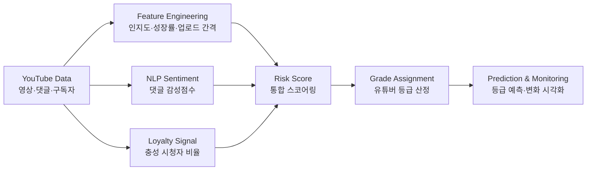

# Samsungfire Risk Management

> 유튜브 인플루언서 협업 리스크를 정량화하기 위한 유튜버 등급 평가 모델  
> 2023 삼성화재 데이터기반 리스크관리 경진대회 프로젝트

[](requirements.txt)
[](notebooks)
[](notebooks/06_sentiment_lstm_modeling.ipynb)
[](docs/project-summary.md)

## At A Glance

| Item | Description |
| --- | --- |
| Problem | 브랜드가 인플루언서와 협업할 때 발생할 수 있는 평판·성과 리스크를 사전에 평가 |
| Data | 유튜브 영상 메타데이터, 댓글 반응, 월별 구독자 지표, 업로드 주기 |
| Method | 감성 분석, 충성도 산정, 성장률·인지도 지표 설계, 등급 스코어링, 등급 예측 |
| Output | 유튜버별 리스크 등급, 월별 지표 변화, 예측 모델링 실험, 최종 발표자료 |
| Portfolio Focus | 비즈니스 문제 정의, 비정형·정형 데이터 결합, 평가 프레임워크 설계 |

## Why This Project Matters

기업의 인플루언서 마케팅은 단순 노출량만으로 성과를 판단하기 어렵습니다. 구독자 수가 높아도 댓글 반응이 부정적이거나, 업로드 주기가 불안정하거나, 팬덤 충성도가 낮으면 브랜드 협업 리스크가 커질 수 있습니다.

이 프로젝트는 유튜버를 하나의 평가 대상처럼 보고, 다음 질문에 답하는 리스크 관리 프레임워크를 설계했습니다.

- 어떤 유튜버가 안정적인 협업 성과를 낼 가능성이 높은가?
- 댓글 감성과 충성 시청자 비율은 협업 리스크 판단에 얼마나 도움이 되는가?
- 월별 지표 변화로 유튜버 등급 변동을 설명하거나 예측할 수 있는가?

## Analysis Pipeline



## Key Contributions

- **문제 재정의**: 인플루언서 협업 대상을 마케팅 지표가 아니라 리스크 관리 관점의 평가 대상으로 정의했습니다.
- **지표 설계**: 조회수·구독자 수 중심의 외형 지표에 댓글 감성, 충성도, 업로드 안정성을 결합했습니다.
- **NLP 적용**: 댓글 텍스트를 전처리하고 LSTM 기반 감성 분석을 실험해 월별 감성점수를 산출했습니다.
- **평가 모델링**: 신용평점 모형의 아이디어를 참고해 유튜버 등급 기준과 스코어링 구조를 만들었습니다.
- **포트폴리오 정리**: 원천 댓글·대형 모델 파일은 제외하고, 검토 가능한 산출물과 분석 흐름 중심으로 공개 레포를 재구성했습니다.

## Repository Structure

```text
.
├── assets/
│   └── final-presentation.pdf
├── data/
│   ├── README.md
│   └── processed/
├── docs/
│   ├── analysis-method.md
│   ├── data-dictionary.md
│   └── project-summary.md
├── notebooks/
│   ├── 01_youtube_data_collection.ipynb
│   ├── 06_sentiment_lstm_modeling.ipynb
│   ├── 10_grade_threshold_design.ipynb
│   ├── 12_grade_prediction_ml.ipynb
│   └── 14_grade_score_visualization.ipynb
└── requirements.txt
```

## What To Review First

| Order | File | Why |
| --- | --- | --- |
| 1 | [docs/project-summary.md](docs/project-summary.md) | 프로젝트 문제 정의와 포트폴리오 관점 요약 |
| 2 | [assets/final-presentation.pdf](assets/final-presentation.pdf) | 최종 발표 흐름과 비즈니스 제안 확인 |
| 3 | [docs/analysis-method.md](docs/analysis-method.md) | 데이터 수집부터 등급 예측까지의 분석 방법 |
| 4 | [notebooks/06_sentiment_lstm_modeling.ipynb](notebooks/06_sentiment_lstm_modeling.ipynb) | 댓글 감성 분석 모델링 흐름 |
| 5 | [notebooks/14_grade_score_visualization.ipynb](notebooks/14_grade_score_visualization.ipynb) | 등급·점수 변화 시각화 결과 |

## Notebook Guide

| Step | Notebook | Purpose |
| --- | --- | --- |
| 01 | [`01_youtube_data_collection.ipynb`](notebooks/01_youtube_data_collection.ipynb) | YouTube API 기반 데이터 수집 |
| 02-04 | [`02_*`](notebooks/02_legacy_youtube_crawling_selenium.ipynb) ~ [`04_*`](notebooks/04_data_quality_check.ipynb) | Selenium 수집 실험과 데이터 점검 |
| 05 | [`05_comment_labeling_preprocess.ipynb`](notebooks/05_comment_labeling_preprocess.ipynb) | 댓글 라벨링 데이터 전처리 |
| 06 | [`06_sentiment_lstm_modeling.ipynb`](notebooks/06_sentiment_lstm_modeling.ipynb) | LSTM 기반 댓글 감성 분석 |
| 07-09 | [`07_*`](notebooks/07_comment_loyalty_score.ipynb) ~ [`09_*`](notebooks/09_feature_merge.ipynb) | 충성도, 업로드 간격, 통합 지표 생성 |
| 10-11 | [`10_*`](notebooks/10_grade_threshold_design.ipynb), [`11_*`](notebooks/11_grade_assignment.ipynb) | 등급 기준 산정과 등급 부여 |
| 12-13 | [`12_*`](notebooks/12_grade_prediction_ml.ipynb), [`13_*`](notebooks/13_grade_prediction_deep_learning.ipynb) | 등급 예측 모델링 |
| 14 | [`14_grade_score_visualization.ipynb`](notebooks/14_grade_score_visualization.ipynb) | 등급 및 점수 변화 시각화 |

## Data Policy

이 레포는 포트폴리오 공개용으로 정리했습니다. 공개 적합성과 용량 관리를 위해 원천 댓글 데이터, 학습된 모델 가중치, 토크나이저, ChromeDriver 실행 파일은 제외했습니다.

공개된 데이터는 `data/processed/`에 있는 집계·점수·등급 산출물 중심입니다. 자세한 설명은 [data/README.md](data/README.md)와 [docs/data-dictionary.md](docs/data-dictionary.md)를 참고하세요.

## Environment

주요 분석 환경은 Python/Jupyter Notebook입니다.

```bash
pip install -r requirements.txt
```

일부 수집 노트북은 Selenium, ChromeDriver, YouTube 페이지 구조에 의존합니다. 현재 공개 버전은 수집 재실행보다 분석 흐름과 산출물 검토를 우선합니다.

## Limitations

- 수집 시점의 YouTube 페이지 구조와 공개 지표에 의존합니다.
- 댓글 원문과 대형 모델 파일은 공개하지 않아 전체 재학습은 이 레포만으로 재현되지 않습니다.
- 일부 원본 산출물에는 당시 인코딩 문제로 깨진 컬럼명이 남아 있습니다. 문서에서는 사람이 해석 가능한 수준으로 정리했습니다.

## More Details

- [Project Summary](docs/project-summary.md)
- [Analysis Method](docs/analysis-method.md)
- [Data Dictionary](docs/data-dictionary.md)
