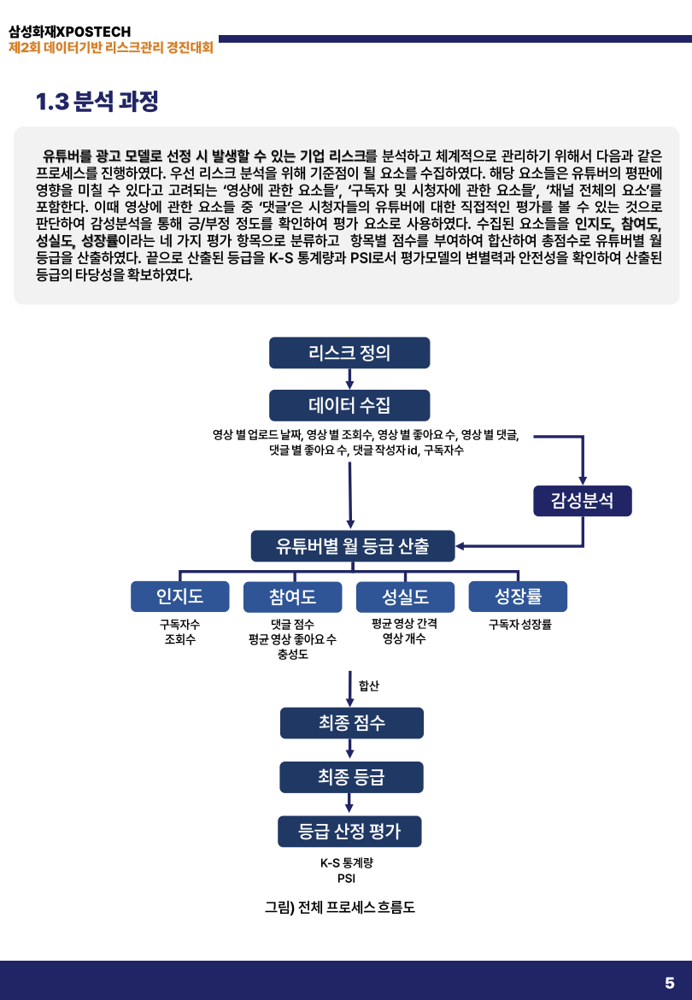
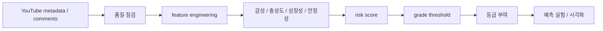
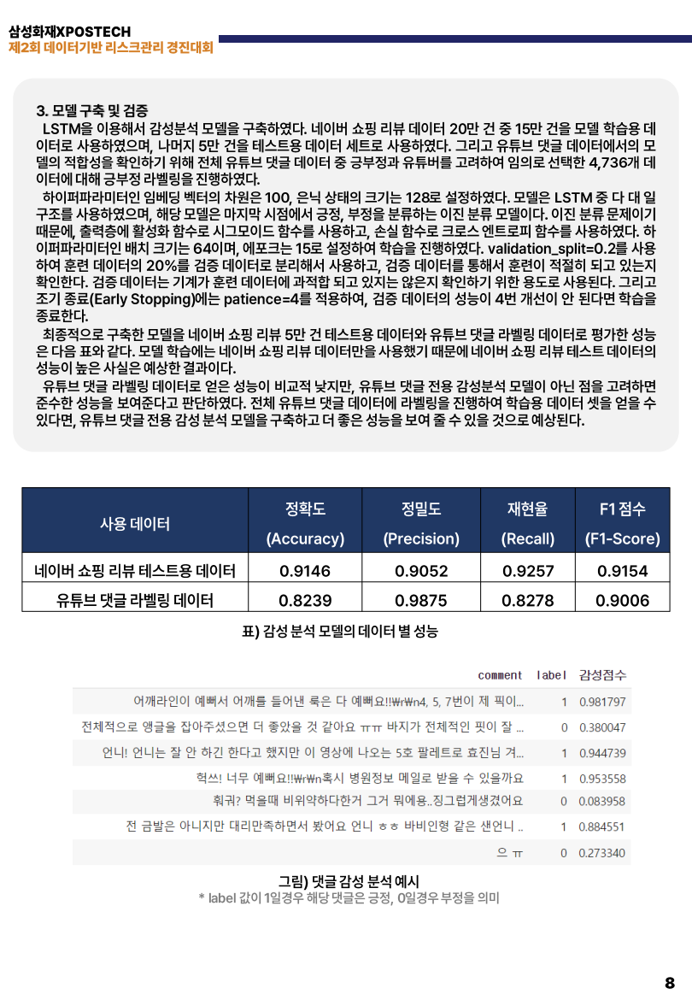
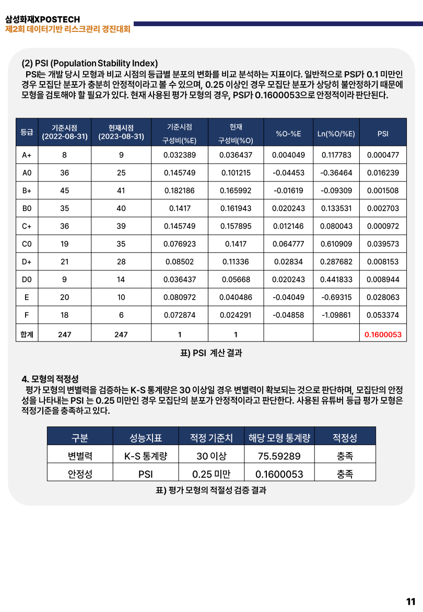

# Samsungfire Risk Management

<p align="center">2023 삼성화재 데이터 기반 리스크관리 경진대회 · 인플루언서 협업 리스크 평가 · Python</p>

<p align="center"></p>

<p align="center"><a href="assets/final-presentation.pdf">실제 최종 발표자료 보기 (PDF)</a></p>

> 유튜브 협업 후보를 인지도·성장성·충성도·댓글 감성·업로드 안정성으로 살펴보고, 사람이 비교할 수 있는 리스크 등급으로 요약한 팀 분석 프로젝트입니다.

[](requirements.txt)
[](notebooks)
[](notebooks/06_sentiment_lstm_modeling.ipynb)
[](docs/project-summary.md)

## 한눈에 보기

| 구분 | 내용 |
| --- | --- |
| 프로젝트 | 2023.08–11 · 4인 팀 **정규함수** · 삼성화재 X POSTECH 제2회 데이터기반 리스크관리 경진대회 장려상 |
| 문제 | 도달 규모만으로는 협업 후보의 지속성·반응·운영 안정성을 판단하기 어렵습니다. |
| 해결 | 채널 규모·참여·성장·댓글 반응·업로드 패턴 등 복수 신호를 결합하고, threshold 기반 등급으로 요약했습니다. |
| 산출물 | 단계별 분석 notebook, 방법론 문서, 실제 최종 발표자료(PDF·슬라이드) |
| 공개 범위 | 코드·문서·발표자료만 공개합니다. 데이터와 모델 산출물은 공개하지 않습니다. |

이 저장소는 보험 인수나 손해율 예측 모델이 아닙니다. 브랜드·보험사의 협업 후보 검토에 활용할 수 있는 의사결정 보조 score를 실험한 포트폴리오입니다.

## 문제 정의

협업 후보의 reach가 높아도 최근 성장세가 불안정하거나, 댓글 반응이 부정적이거나, 충성도가 낮거나, 업로드 주기가 불규칙하면 캠페인 리스크가 커질 수 있습니다. 이 프로젝트는 유튜버 채널 데이터를 다면적으로 점수화해 사람이 비교 가능한 등급으로 변환했습니다.

프로젝트 기록 기준으로 약 45만 건의 유튜브 댓글과 채널·영상 메타데이터를 분석에 사용했습니다. 원문 댓글은 공개하지 않으며, 재배포 조건과 사용자 생성 콘텐츠 보호를 위해 집계·파생 데이터도 공개 범위에서 제외합니다.

## 팀과 담당 역할

| 구성원 | 담당 | 구체적 기여 |
| --- | --- | --- |
| **박민규** | 데이터 분석·피처 엔지니어링 | 채널별 영상을 월 단위로 정렬해 **평균 업로드 간격**과 **영상 개수**를 계산하고, 업로드가 없는 달이 연속되는 길이(`null_지속`)를 산출해 업로드 패턴을 점검하는 feature table을 구현했습니다. 후속 등급 설계에서 평균 업로드 간격이 점수 구간으로 사용되는 연결은 [feature notebook](notebooks/08_upload_interval_feature.ipynb)과 [threshold notebook](notebooks/10_grade_threshold_design.ipynb)에서 확인할 수 있으며, 공개 포트폴리오 문서를 정리했습니다. |
| 함다현 | 규모·충성도 점수화 | 구독자 수, 평균 조회수, 충성 시청자 비율을 구간별 점수로 변환하는 [score-table notebook](notebooks/11_grade_assignment.ipynb)을 구현했습니다. |
| 박소정 | 성장·감성·업로드 간격 기준 설계 | 구독자 성장률·감성점수·평균 업로드 간격의 분포를 확인하고 점수 threshold를 설계하는 [notebook](notebooks/10_grade_threshold_design.ipynb)을 구현했습니다. |
| 문창수 | 도메인 리서치·활용 시나리오·발표 | 인플루언서 협업 리스크와 보험 활용 맥락을 조사하고, 기업 의사결정·보험 활용 시나리오 및 최종 발표 구성을 담당했습니다. |

> 본 저장소는 팀 산출물의 포트폴리오 버전입니다. 역할은 팀 기록과 공개 artifact를 기준으로 정리했으며, 박민규의 기여는 데이터 분석·피처 엔지니어링과 공개 포트폴리오 문서화 범위로 명확히 표시합니다. 전체 결과물을 개인 단독 성과로 주장하지 않습니다.

## 기술적 의사결정

| 영역 | 선택 | 이유 |
| --- | --- | --- |
| 감성 분석 | LSTM 기반 댓글 감성 모델 | 댓글 반응을 정량 score로 변환하기 위한 핵심 단계입니다. |
| 리스크 feature | 채널 규모·참여·성장·충성도·감성·업로드 패턴 | 단일 인기 지표보다 협업 리스크를 입체적으로 보기 위함입니다. |
| 등급화 | score threshold 설계 | 실제 프로젝트에서는 A+부터 F까지 10개 등급으로 요약하기 위함입니다. |
| 공개 정책 | 코드·문서·발표자료만 공개 | 원본·파생 데이터의 재배포 조건과 식별 가능성 리스크를 줄이기 위함입니다. |

## 파이프라인

<p align="center"></p>

<p align="center"><sub>실제 최종 발표자료 5쪽에서 추출한 분석 과정 슬라이드입니다.</sub></p>


```mermaid
flowchart LR
    A["YouTube metadata / comments"] --> B["품질 점검"]
    B --> C["feature engineering"]
    C --> D["감성 / 충성도 / 성장성 / 안정성"]
    D --> E["risk score"]
    E --> F["grade threshold"]
    F --> G["등급 부여"]
    G --> H["예측 실험 / 시각화"]
```

## 분석 근거

- [`notebooks/00_public_scoring_demo.ipynb`](notebooks/00_public_scoring_demo.ipynb): 가상·비식별 예시 입력으로 공개 실행 가능한 score→grade 흐름
- `notebooks/06_sentiment_lstm_modeling.ipynb`: 댓글 전처리, sequence 구성, LSTM 학습, classification metric 확인
- `notebooks/10_grade_threshold_design.ipynb`: score threshold 설계
- `notebooks/11_grade_assignment.ipynb`: 구독자·조회수·충성도 component score 산정
- [`assets/final-presentation.pdf`](assets/final-presentation.pdf): 실제 최종 발표자료

공개 저장소에서는 원본 학습 데이터와 당시 실행 환경이 없어 성능을 다시 산출하거나 비교하지 않습니다. 대신 [공개 데모](notebooks/00_public_scoring_demo.ipynb)는 실제 데이터와 무관한 가상 입력으로 score→grade 계산 연결만 재현합니다. 예측 모델 notebook은 [archive](notebooks/archive/README.md)로 분리했으며, 성능 근거가 아닌 당시의 탐색 기록으로만 보존합니다. 아래 값은 재실행 결과가 아니라 실제 최종 발표자료에 남은 검증 기록입니다.

## 최종 발표자료 기준 검증 결과

아래 수치는 현재 공개 저장소에서 다시 학습해 산출한 값이 아니라, 실제 최종 발표자료에 기록된 프로젝트 결과입니다.

| 검증 대상 | 기록된 결과 | 해석 |
| --- | --- | --- |
| 댓글 감성 LSTM | 유튜브 댓글 라벨 데이터 F1-score **0.9006** | 네이버 쇼핑 리뷰 20만 건(학습 15만·테스트 5만)을 기준으로 모델을 학습·평가한 뒤, 직접 라벨링한 유튜브 댓글 4,736건으로 도메인 적용 성능을 확인했습니다. |
| 등급 모형 변별력 | K-S **75.59289** | 발표자료의 적정성 기준인 30 이상을 충족했습니다. |
| 등급 모형 안정성 | PSI **0.1600053** | 발표자료의 안정성 기준인 0.25 미만을 충족했습니다. |

<details>
<summary>실제 최종 발표자료의 검증 슬라이드 보기</summary>

<p></p>

<p></p>

</details>

## 재현 가능성

```bash
python -m venv .venv
# Windows PowerShell: .venv\Scripts\Activate.ps1
pip install -r requirements.txt
```

`requirements.txt`는 notebook 구조를 검토하기 위한 호환 범위를 제공합니다. raw comment, 수집 결과, 모델 가중치, 당시 실행 환경을 공개하지 않았기 때문에 전체 수집·학습의 동일 결과 재현은 지원하지 않습니다. 자세한 실행 경계는 [notebooks/README.md](notebooks/README.md)를 확인하세요.

`konlpy` 실행에는 Java JDK가 추가로 필요하며, Selenium 수집 notebook은 YouTube 화면 구조와 수집 시점에 따라 동작하지 않을 수 있습니다.

공개 데모의 계산 코드는 Python 표준 라이브러리만 사용합니다. `.ipynb` 파일 자체를 실행하려면 Jupyter runtime이 필요합니다.

```bash
python -m jupyter nbconvert --execute --to notebook --stdout notebooks/00_public_scoring_demo.ipynb
```

## 공개/비공개 경계

- 공개: 단계별 notebook, 분석 방법론, 실제 최종 발표자료
- 제외: 원본 댓글·수집 결과·파생 데이터, 모델 산출물, 재배포 조건이 불명확한 자료, 비밀값
- 재현: 공개 데모는 가상 입력으로 score→grade 계산 연결만 확인합니다.

## 한계

- 등급은 협업 후보 검토를 돕는 참고 지표이며 최종 의사결정이 아닙니다.
- raw data가 제외되어 end-to-end reproduction은 불가능합니다.
- 공개 데모의 입력·가중치·등급 기준은 데이터 경계를 지키기 위한 설명용 값이며, 실제 대회 결과를 재현하지 않습니다.
- 리스크 score는 실제 손해율이나 보험 underwriting 결과를 예측하지 않습니다.

## 이용 안내

이 저장소는 포트폴리오·학습 기록 열람을 위해 공개합니다. 코드·문서·이미지의 재사용, 수정, 배포는 사전 문의가 필요합니다.
