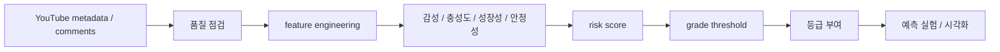

# Samsungfire Risk Management - 인플루언서 협업 리스크 평가

<p align="center">2023 삼성화재 리스크관리 경진대회 · 인플루언서 데이터 분석 · 리스크 등급화 · Python</p>

<p align="center"><a href="assets/final-presentation.pdf">실제 최종 발표 자료 보기</a></p>

> 유튜버/인플루언서 협업 후보를 인지도, 성장성, 충성도, 감성, 업로드 안정성 관점에서 등급화한 리스크 관리 프로젝트입니다.

[](requirements.txt)
[](notebooks)
[](notebooks/06_sentiment_lstm_modeling.ipynb)
[](docs/project-summary.md)

## 개요

2023 삼성화재 데이터 기반 리스크 관리 경진대회 프로젝트의 포트폴리오 버전입니다. 팔로워 수나 평균 조회수만으로 협업 대상을 고르는 대신, 댓글 감성, 성장성, 충성도, 업로드 주기, 인지도 지표를 결합해 협업 리스크를 검토할 수 있는 등급화 framework를 만들었습니다.

이 저장소는 보험 인수 모델이나 손실 예측 모델이 아닙니다. 브랜드/보험사가 협업 후보를 검토할 때 사용할 수 있는 decision-support score를 실험한 데이터 분석 프로젝트입니다.

## 빠른 검토 경로

| 먼저 볼 것 | 확인할 내용 |
| --- | --- |
| [docs/project-summary.md](docs/project-summary.md) | 문제 정의, 역할 범위, 공개 가능한 evidence map |
| [docs/analysis-method.md](docs/analysis-method.md) | metadata/comment에서 score/grade까지의 분석 흐름 |
| [docs/data-dictionary.md](docs/data-dictionary.md) | 공개 processed file 의미와 제외 데이터 |
| [notebooks/06_sentiment_lstm_modeling.ipynb](notebooks/06_sentiment_lstm_modeling.ipynb) | 댓글 감성 모델링 evidence |
| [notebooks/10_grade_threshold_design.ipynb](notebooks/10_grade_threshold_design.ipynb) | 등급 threshold 설계 |

## 문제 정의

협업 후보의 reach가 높아도 최근 성장세가 불안정하거나, 댓글 반응이 부정적이거나, 충성도가 낮거나, 업로드 주기가 불규칙하면 캠페인 리스크가 커질 수 있습니다. 이 프로젝트는 유튜버 채널 데이터를 다면적으로 점수화해 사람이 비교 가능한 등급으로 변환했습니다.

## 내 역할

팀 프로젝트 산출물이며, 공개 포트폴리오에서 설명 가능한 기여는 다음과 같습니다.

- 협업 리스크 관점의 문제 정의와 feature dimension 정리
- 댓글 감성, 충성도, 성장성, 업로드 안정성 등 score 구성 문서화
- notebook pipeline을 reviewer가 따라갈 수 있도록 단계별 정리
- raw comment, crawl artifact, model weight, vectorizer, 대용량 중간 파일 제외
- 공개 가능한 processed output과 문서 중심의 검토 경로 구성

## 기술적 의사결정

| 영역 | 선택 | 이유 |
| --- | --- | --- |
| 감성 분석 | LSTM 기반 댓글 감성 모델 | 댓글 반응을 정량 score로 변환하기 위한 핵심 단계입니다. |
| 리스크 feature | 인지도, 성장성, 충성도, 감성, 업로드 안정성 | 단일 인기 지표보다 협업 리스크를 입체적으로 보기 위함입니다. |
| 등급화 | score threshold 설계 | 사람이 검토 가능한 A/B/C 등급 형태로 요약하기 위함입니다. |
| 공개 정책 | processed/aggregate 중심 공개 | raw comment와 crawl data의 개인정보/재배포 리스크를 줄이기 위함입니다. |

## 파이프라인


```mermaid
flowchart LR
    A["YouTube metadata / comments"] --> B["품질 점검"]
    B --> C["feature engineering"]
    C --> D["감성 / 충성도 / 성장성 / 안정성"]
    D --> E["risk score"]
    E --> F["grade threshold"]
    F --> G["등급 부여"]
    G --> H["예측 실험 / 시각화"]
```

## 결과 근거

- `notebooks/06_sentiment_lstm_modeling.ipynb`: 댓글 전처리, sequence 구성, LSTM 학습, classification metric 확인
- `notebooks/10_grade_threshold_design.ipynb`: score threshold 설계
- `notebooks/11_grade_assignment.ipynb`: 최종 grade 부여
- `notebooks/12_grade_prediction_ml.ipynb`, `13_grade_prediction_deep_learning.ipynb`: grade prediction 실험
- `data/processed/`: 공개 가능한 processed score/grade output

## 재현 가능성

```bash
pip install -r requirements.txt
```

공개 저장소에서는 notebook과 processed output을 검토할 수 있습니다. raw comment, raw crawl, model weight, text vectorizer, local driver는 공개하지 않았기 때문에 전체 수집/학습 재현은 제한됩니다.

## 공개/비공개 경계

포함:

- 단계별 notebook
- processed/aggregate score data
- 분석 방법론과 data dictionary
- 최종 발표 자료

제외:

- raw YouTube comments, raw crawl outputs
- local Selenium/ChromeDriver 실행 파일
- model weight, vectorizer, cache
- 개인정보 가능 자료, credential, 대용량 중간 산출물

## 한계

- 등급은 협업 후보 검토를 돕는 참고 지표이며 최종 의사결정이 아닙니다.
- raw data가 제외되어 end-to-end reproduction은 불가능합니다.
- 일부 notebook은 경진대회 당시 실험 기록을 보존하고 있어 production code 수준으로 정리되어 있지 않습니다.
- 리스크 score는 실제 손해율이나 보험 underwriting 결과를 예측하지 않습니다.
