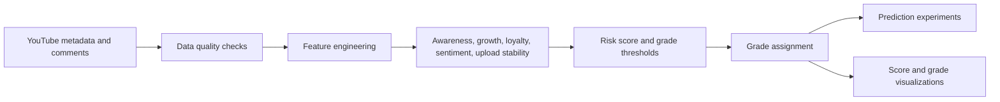

# Samsungfire Risk Management

> YouTuber and influencer grading framework for sponsor-collaboration risk review.
> Portfolio version of a 2023 Samsung Fire & Marine Insurance data-based risk-management competition project.

[](requirements.txt)
[](notebooks)
[](notebooks/06_sentiment_lstm_modeling.ipynb)
[](docs/project-summary.md)

## Portfolio Quick Scan

| What to inspect first | Why it matters |
| --- | --- |
| [docs/project-summary.md](docs/project-summary.md) | Reviewer path, risk-management problem framing, role boundary, and public-safe evidence map |
| [docs/analysis-method.md](docs/analysis-method.md) | End-to-end Pipeline from YouTube metadata and comments to grade scoring and model experiments |
| [docs/data-dictionary.md](docs/data-dictionary.md) | Meaning of public processed files, excluded data classes, and interpretation limits |
| [notebooks/06_sentiment_lstm_modeling.ipynb](notebooks/06_sentiment_lstm_modeling.ipynb) | LSTM sentiment-model evidence for converting comments into a graded signal |
| [notebooks/10_grade_threshold_design.ipynb](notebooks/10_grade_threshold_design.ipynb) and [notebooks/11_grade_assignment.ipynb](notebooks/11_grade_assignment.ipynb) | Grade threshold design and score-to-grade assignment logic |
| [notebooks/12_grade_prediction_ml.ipynb](notebooks/12_grade_prediction_ml.ipynb), [notebooks/13_grade_prediction_deep_learning.ipynb](notebooks/13_grade_prediction_deep_learning.ipynb), and [notebooks/14_grade_score_visualization.ipynb](notebooks/14_grade_score_visualization.ipynb) | Prediction experiments and score/grade visualization checks |
| [assets/final-presentation.pdf](assets/final-presentation.pdf) | Existing final report artifact; inspect as supporting context, not as a claim that all raw materials are public |

## At A Glance

| Item | Description |
| --- | --- |
| Problem | Brands and insurers need a more risk-aware way to evaluate influencer partnerships than follower count or average view count alone. |
| Risk question | Which YouTubers show stable, positive, loyal, and growing audience signals, and which ones carry evidence of collaboration risk? |
| Role | This portfolio emphasizes the repository owner's contribution to problem framing, public-safe repo curation, feature design, notebook pipeline organization, scoring documentation, and model-evidence explanation. It does not claim sole ownership of the competition team deliverable. |
| Data | Public repo includes processed score, grade, and aggregate files. Raw comments, raw crawls, local browser drivers, model weights, text-vectorizer artifacts, and large intermediate artifacts are intentionally excluded. |
| Method | Combine awareness, growth, comment sentiment, loyalty, and upload-stability signals into a YouTuber grading framework, then inspect whether grades can be predicted from monthly feature histories. |
| Evidence | Notebooks show the inspectable path for sentiment modeling, feature merging, threshold design, grade assignment, grade prediction, and visualization. Processed outputs in `data/processed/` support inspection of the scoring surface. |
| Public reproduction | Partial and inspection-first. The repo supports reviewing the pipeline and processed outputs, but not recreating raw data collection or model training from private/raw comments. |

## Risk-Management Framing

The project treats influencer selection as a risk-management problem. A creator with high reach can still be a weak collaboration candidate when recent growth is unstable, comment sentiment is negative, loyal engagement is low, or upload cadence is unreliable. Those signals matter to a brand because they can affect campaign scheduling, reputation exposure, and confidence in repeated performance.

The model is not an insurance underwriting model and does not estimate financial loss. It is a ranking and grading artifact that translates creator-channel signals into a reviewable score so that a human reviewer can compare candidates and ask better risk questions.

## Pipeline


```mermaid
flowchart LR
    A["YouTube metadata and comments"] --> B["Data quality checks"]
    B --> C["Feature engineering"]
    C --> D["Awareness, growth, loyalty, sentiment, upload stability"]
    D --> E["Risk score and grade thresholds"]
    E --> F["Grade assignment"]
    F --> G["Prediction experiments"]
    F --> H["Score and grade visualizations"]
```

Key inspectable stages:

- `01_youtube_data_collection.ipynb` through `04_data_quality_check.ipynb`: collection experiments, metadata assembly, and quality checks.
- `05_comment_labeling_preprocess.ipynb` and `06_sentiment_lstm_modeling.ipynb`: comment labeling, preprocessing, text vectorization, LSTM sentiment modeling, and sentiment score export.
- `07_comment_loyalty_score.ipynb` through `09_feature_merge.ipynb`: loyalty, upload interval, and integrated feature table construction.
- `10_grade_threshold_design.ipynb` and `11_grade_assignment.ipynb`: score thresholds and final grade assignment.
- `12_grade_prediction_ml.ipynb` and `13_grade_prediction_deep_learning.ipynb`: grade prediction experiments over engineered features.
- `14_grade_score_visualization.ipynb`: reviewer-facing score and grade trend inspection.

## Model Evidence

The strongest public evidence in this repo is not a single leaderboard number. It is the traceable modeling surface:

- Sentiment-model notebook includes Korean comment preprocessing, rare-word handling, sequence preparation, LSTM training, and classification metrics such as accuracy, recall, precision, F1, AUC, and confusion matrix outputs.
- Score notebooks expose the engineered dimensions used for grading rather than hiding the grade as a black-box output.
- Processed files such as `final_all_data.xlsx`, `raw_data_score.csv`, `감성점수.csv`, `충성도.csv`, `인지도부문.csv`, and `등급_예측.xlsx` let a reviewer inspect the public score/grade surface without raw comments.
- Visualization notebook checks whether grade scores move over time in interpretable ways for specific creators.

The README intentionally avoids publishing unsupported metric values because the raw training data and original execution environment are not fully included.

## Data Policy

Included public files are limited to processed, aggregate, score, and grade artifacts needed to understand the method. See [data/README.md](data/README.md) and [docs/data-dictionary.md](docs/data-dictionary.md).

Excluded from the public portfolio surface:

- raw YouTube comments and raw crawl outputs,
- personal or user-generated text that is not necessary for public review,
- local Selenium or ChromeDriver execution files,
- model weights, text-vectorizer files, caches, and generated NLP intermediate files,
- large intermediate data exports,
- any proprietary, private, credential, or contest-restricted material.

This policy is reflected in `.gitignore`, which excludes raw folders, comment folders, model artifacts, generated NLP outputs, browser drivers, notebook checkpoints, and local environment files.

## Notebook Guide

| Step | Notebook | Reviewer use |
| --- | --- | --- |
| 01 | [`01_youtube_data_collection.ipynb`](notebooks/01_youtube_data_collection.ipynb) | Understand original collection assumptions. |
| 02 | [`02_legacy_youtube_crawling_selenium.ipynb`](notebooks/02_legacy_youtube_crawling_selenium.ipynb) | Inspect legacy Selenium collection experiments; not recommended as the public reproduction path. |
| 03 | [`03_video_metadata_collection.ipynb`](notebooks/03_video_metadata_collection.ipynb) | Inspect video metadata collection logic. |
| 04 | [`04_data_quality_check.ipynb`](notebooks/04_data_quality_check.ipynb) | Inspect quality checks and missing-data handling. |
| 05 | [`05_comment_labeling_preprocess.ipynb`](notebooks/05_comment_labeling_preprocess.ipynb) | Inspect labeled-comment preprocessing. |
| 06 | [`06_sentiment_lstm_modeling.ipynb`](notebooks/06_sentiment_lstm_modeling.ipynb) | Inspect LSTM sentiment modeling and sentiment-score export logic. |
| 07 | [`07_comment_loyalty_score.ipynb`](notebooks/07_comment_loyalty_score.ipynb) | Inspect loyalty score construction. |
| 08 | [`08_upload_interval_feature.ipynb`](notebooks/08_upload_interval_feature.ipynb) | Inspect upload-cadence feature engineering. |
| 09 | [`09_feature_merge.ipynb`](notebooks/09_feature_merge.ipynb) | Inspect merged feature table construction. |
| 10 | [`10_grade_threshold_design.ipynb`](notebooks/10_grade_threshold_design.ipynb) | Inspect grade threshold design. |
| 11 | [`11_grade_assignment.ipynb`](notebooks/11_grade_assignment.ipynb) | Inspect final grade assignment. |
| 12 | [`12_grade_prediction_ml.ipynb`](notebooks/12_grade_prediction_ml.ipynb) | Inspect machine-learning grade prediction experiments. |
| 13 | [`13_grade_prediction_deep_learning.ipynb`](notebooks/13_grade_prediction_deep_learning.ipynb) | Inspect deep-learning grade prediction experiments. |
| 14 | [`14_grade_score_visualization.ipynb`](notebooks/14_grade_score_visualization.ipynb) | Inspect score and grade trend visualizations. |

## Repository Structure

```text
.
|-- assets/
|   |-- README.md
|   `-- final-presentation.pdf
|-- data/
|   |-- README.md
|   `-- processed/
|-- docs/
|   |-- analysis-method.md
|   |-- data-dictionary.md
|   `-- project-summary.md
|-- notebooks/
|   |-- 01_youtube_data_collection.ipynb
|   |-- 06_sentiment_lstm_modeling.ipynb
|   |-- 10_grade_threshold_design.ipynb
|   |-- 12_grade_prediction_ml.ipynb
|   `-- 14_grade_score_visualization.ipynb
|-- README.md
`-- requirements.txt
```

## Reproducibility

Install the analysis environment:

```bash
pip install -r requirements.txt
```

Recommended public inspection path:

1. Read [docs/project-summary.md](docs/project-summary.md).
2. Inspect [docs/analysis-method.md](docs/analysis-method.md) and [docs/data-dictionary.md](docs/data-dictionary.md).
3. Review notebooks in numeric order, treating collection notebooks as historical context and later notebooks as the scoring/model-evidence path.
4. Inspect `data/processed/` outputs for public score and grade artifacts.

Full raw-data reproduction is intentionally blocked because the repo excludes raw comments, raw crawls, local execution artifacts, and model files that should not be published.

## Limitations

- This is a competition and portfolio artifact, not a deployed risk system.
- Grades are decision-support signals, not final approval or rejection decisions for an influencer partnership.
- Raw comments and crawl outputs are excluded, so public reviewers can inspect the method and outputs but cannot fully rerun data collection or model training end to end.
- Some notebooks preserve original Korean comments and historical experimentation code; they are evidence of the working path rather than a polished production package.
- Some processed CSV/XLSX files retain original column names and encoding quirks from the notebook environment.
- The repo does not publish proprietary/private datasets, personal raw comment records, text-vectorizer artifacts, model weights, or unsupported business-impact claims.

## More Details

- [Project Summary](docs/project-summary.md)
- [Analysis Method](docs/analysis-method.md)
- [Data Dictionary](docs/data-dictionary.md)
